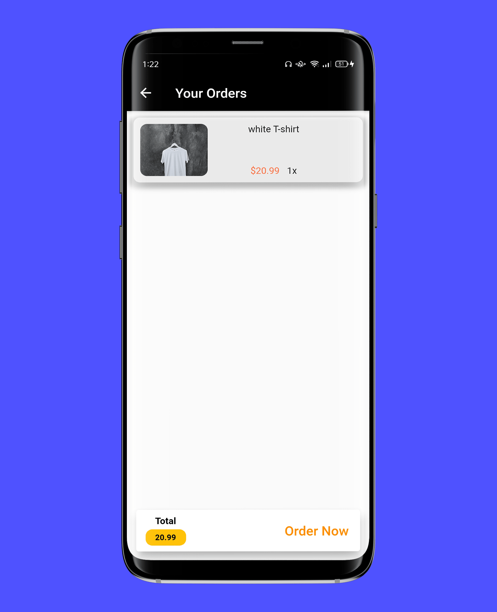
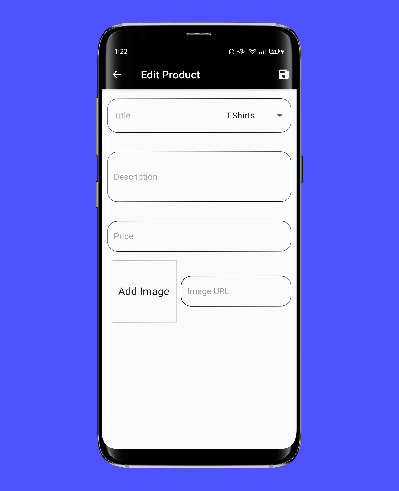

# shopApp
An e-commerce app which allows users to buy and sell items.

# Screenshots

    
    
    
    
    
    
    
    
    
    
    
    
    
    
    
    

# Features
- Full authentication with firebase containing (Sign in, Sign up, logout).
- Save the user data when sign up or log in for the first time to keep logged in using Shared-Preferences.
- Back end validation and error handling incase of wrong inputs or technical issue.
- The main screen shows the list of available products registered by all the other users.
- Provided with categories in which you can easily find your product.
- The user is able to favorite a product, add it to the cart or to check the product details on a new screen.
- The user can undo the addition of the product.
- The user is able to check the items on the cart at the cart screen ,the quantity that was added for each item and the total amount of the order.
- The user can then place an order or remove an item from the cart by swipe left.
- The user can add, edit and remove his/her own products on the Manage Products screen.
- The user can see a list of the previous orders.
- The user can search for any product by enter the name of it or a character and it will show the products with that character.
- Bloc statemanagement

## Getting Started

This project is a starting point for a Flutter application.

A few resources to get you started if this is your first Flutter project:

- [Lab: Write your first Flutter app](https://flutter.dev/docs/get-started/codelab)
- [Cookbook: Useful Flutter samples](https://flutter.dev/docs/cookbook)

For help getting started with Flutter, view our
[online documentation](https://flutter.dev/docs), which offers tutorials,
samples, guidance on mobile development, and a full API reference.
